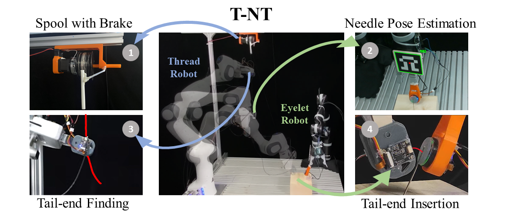
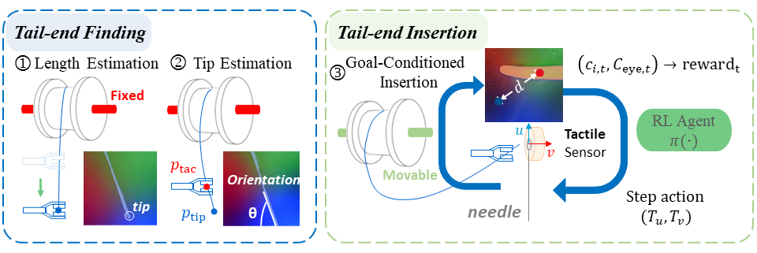

# Precise Robotic Needle-Threading with Tactile Perception and Reinforcement Learning  
[**Paper**](https://proceedings.mlr.press/v229/yu23c.html) | [**Project Page**](https://sites.google.com/view/tac-needlethreading) <br>

<div style="text-align: center">

</div>

<div style="text-align: center">

</div>

This repository contains the implementation of the paper:  

**Precise Robotic Needle-Threading with Tactile Perception and Reinforcement Learning**  
Zhenjun Yu*, Wenqiang Xu*, Siqiong Yao, Jieji Ren, Tutian Tang, Yutong Li, Guoying Gu, Cewu Lu (* = Equal contribution)  
**CoRL 2023**

The code is divided into two parts:
- **Control**: The code for controling the Franka Emika panda arm
- **RL_demo**: The code used for training the policy in the simulation environment

## Get-Started
The code is only tested on Ubuntu, we will soon test it on Windows system. 

## With conda and pip

Install [anaconda](https://www.anaconda.com/) or [miniconda](https://docs.conda.io/en/latest/miniconda.html). Supposing that the name `tnt` is used for conda environment:

```shell
conda create -y -n tnt python=3.8
conda activate tnt
```

Then, install dependencies with `pip install`

```shell
pip install -r requirements.txt
```

Besides, you need to install [Grounded-SAM](https://github.com/IDEA-Research/Grounded-Segment-Anything) and [moveit-tutorial](https://github.com/ros-planning/moveit_tutorials) with ROS support
